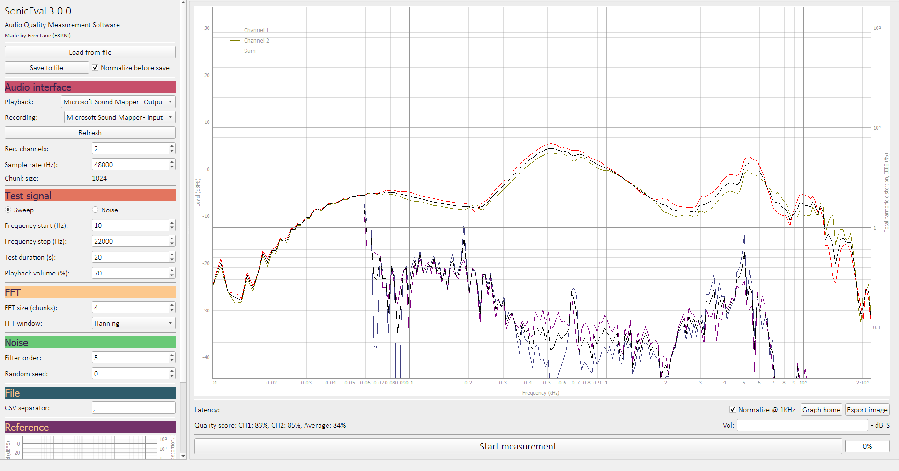

# Pulsely
## Frequency response measurement software

    

        
    

    

        
        
        
    

|  |  |
|:-------------------------:|:-------------------------:|

----------

### Description

Pulsely is a free program that allows you to very accurately and professionally measure the frequency response of audio systems, compare them and export

Currently, there are 2 types of frequency response measurements:
- Using frequency sweep (maximum accuracy, but annoying sound)
- Using white noise (does not provide high accuracy, but allows you to quickly measure the frequency response without annoying sounds)

*App and logo created by Fern Lane (aka. F3RNI)*

----------

### How to use it

1. Connect your audio interface to PC and run Pulsely app
2. In **Audio interface** section select your output and input devices
3. Specify sample rate, start and stop frequencies, test duration and other parameters
4. If possible, connect the output of your audio interface to the input. Run the test and save the result. This is required for calibration
5. Connect your audio system to the interface *(for example, the output of the audio interface connect to the speakers whose frequency response you want to measure, and the input to high-quality linear microphone)*
6. Select calibration profile (if available) in the **Reference** section
7. Start measurement and wait
8. Done! You can save frequency response to CSV file or export as PNG image *(it is recommended to open the application in full screen for an image in a higher resolution)*
